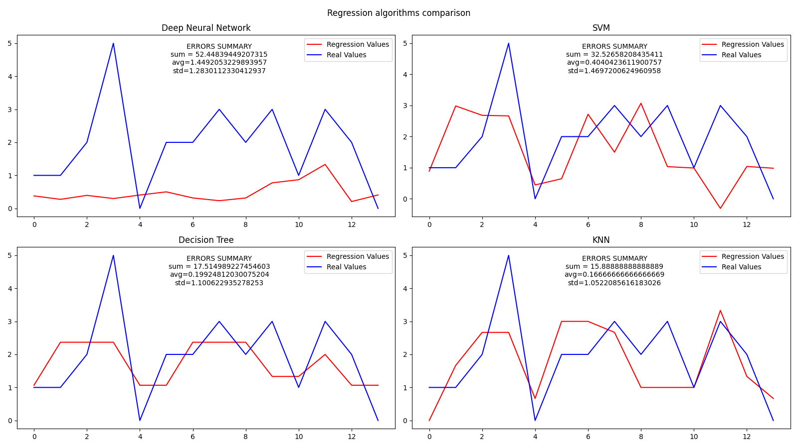

# AI, Map Prediction
```AI Supervised learning from data```
```Created in July and August 2021```
```Professional Holiday Practice 2021```

---

## Project Description

Using AI and Machine Learning AI Model has to recognise specific places on the production hall map. 
Program must perform a pipeline of operations:
1. Clustering
2. Classification
3. Regression

Thanks to clustering Machine Learning algorithms can learn how the specific places on the production hall
are placed on the map.

After Classification AI Model learn and best reflect the time spent by an employee in a 
given area (see the description of the input data).

The whole project is also intended to study and review the available machine learning algorithms.

---

## Data details and description

1. Train and test data stores information about employees moving inside the production hall. 
Data file stores information about their ID, coordinates (x and y), measurement time and other (unnecessary for description) data.


2. Train and test data was created from the breakdown of data held in the database. 
Database can export data to 2 different files formats - json and csv, so the program has to
be able to read files in both these formats.
   

3. Data is truly used to analyze employee movements. They are not made up or designed only for machine learning, 
   which makes it difficult to use them for this purpose
   

4. The data consists of slightly more than 28,000 records
   which must still be broken down into 3 different employees during the learning process.
   

5. Test data represents 20% of the data and training data 80%.
   

6. Train data shape is always (*n*, 3), which *n* is number of data rows.

All points for a given ID (after standardization) were shown on the chart:


---

## Clustering

During clustering process **5** different algorithms were used:
1. Agglomerative Clustering
2. DBScan
3. KMeans
4. OPTICS
5. Spectral clustering

The main problem using all algorithms was to select the appropriate number of clusters.
The more clusters there were, the smaller the mean square error of the entire population was, but it did not provide a satisfactory solution.
The sum of mean square errors resembled a hyperbola like f(x) = 1/x (with an asymptote at infinity equal to 0 and with positive values for x in range (0, +inf)).

Considering that I chose the number of clusters "by eye" that looked most likely - it was 6.
After tuning the parameters, not every algorithm could cope with proper clustering. 
***Agglomerative Clustering***, ***KMeans*** and ***Spectral Clustereing*** has worked the best.
The results of which are presented below.


---

## Classification

During classification all labels of data were taken from the best clustering algorithm - ***Agglomerative Clustering***. 

During classification process **8** different algorithms were used:
1. Decision Tree
2. K-Nearest Neighbors
3. Logistic Regression
4. Multilayer Perceptron
5. Random Forest
6. SVM
7. Team Classification (team of classifiers)
8. Deep Neural Network (tensorflow)

All algorithms parameters were tuned using Grid Search method (which allows to automatically choices of params).
For all algorithms result chart of decision regions was created.


### Team Classification

+ Parameters of each classifier has been tuned using Grid Search.
+ All classifiers had the same voting weights.
+ VotingClassifier class was used to create a team classifier.

To create Team Classifier model 3 classifiers has been used:
1. KNN
2. SVM
3. Decision Tree


### Deep Neural Network

+ To create Deep Neural Network model ***Tensorflow*** library has been used. 
+ For my own study I experimented with possible optimizers of compiler and layer settings
  - layers count,
  - units number,
  - activation functions.
    

The best results has given by model:

|    Model   | Total params | Trainable params | Non-trainable params |
| :--------: | :----------: | :--------------: | :------------------: |
| sequential |    1,301     |      1,301       |          0           |


| Layer (type)           |     Output Shape       |       Param #          |
| :--------------------: | :--------------------: | :--------------------: |
| dense (Dense)          |       (None, 10)       |         30             |
| dense_1 (Dense)        |      (None, 15)        |        165             |
| dense_2 (Dense)        |      (None, 50)        |        800             |
| dense_3 (Dense)        |      (None, 6)         |        306             |

### Classification Results

I talked with person who know how production hall layout looks like and this person said that
the hall layout was best mapped by ***Decision Tree***, ***Random Forest*** and ***KNN*** 
and that the map recognition **"was done very well"** 😃.

---

## Regression

To my own study I have programmed regression process. As described in [Data details and description](#data-details-and-description)
input data stores measurement time of each measurement. Therefore, it is possible to calculate how long it took to move from one point to another. 
As a result, we can try to reproduce the time curve needed to change the coordinates depending on the position (train a model).

During regression process **4** different algorithms were used:
1. Decision Tree
2. K-Nearest Neighbors
3. SVM
4. Neural Network (tensorflow)

An example of the Models approximations:


As seen in the graphs above, the learned models are much less prone to drastic changes in value, which may be a positive aspect of them. 
Thanks to the approximations created, it is possible to control whether a given movement from point A to point B is in any way suspicious.

---

## Knowledge and skills acquired

This project was my ```Professional Holiday Practice 2021``` so I have spent much more time to study how to write better code which will be easy to understand by others.

Additionally, I have spent a lot of time learning to read scikit-learn and tensorflow documentation, testing different configurations of Models. 

What exactly have I learned:
1. How to create more readable and helpful python documentation - with examples, arguments and returns description, links and  'SeeAlso' section.
2. How to use appropriate models of clustering, classification and regression depending on the problem.
3. How to use tensorflow library to create Dense Deep Neural Networks solving much more difficult problems.
4. How to write more universal functions.
5. How to better to present data in graphs.
6. How to better to use programs that are useful for the programmer's work:
   + Slack,
   + GitHub,
   + YouTrack.
7. How to better process python data using the pandas library.

---

## Summary and general thoughts

1. It was very interesting project. Especially it was my first more commercially project.
2. The biggest fun I have had testing different parameters, layers count, activation functions of Models. 
3. The task to do was quite difficult, especially since the data was real, not made with machine learning in mind.
4. I have experienced commercial software development to some extent.


### Programming thoughts
1. I do like how I created packages - "for_all.py" file used all programmed Machine Learning functions and provided 
   functions that the user did not have to worry about used methods. 
2. I do like division all project functions into packages.

---

## Technology used
+ Python 3.9.5
    + scikit-learn
    + pandas
    + tensorflow
    + matplotlib
    + numpy
    + pyprind

---

## License & copyright
© All rights reserved
